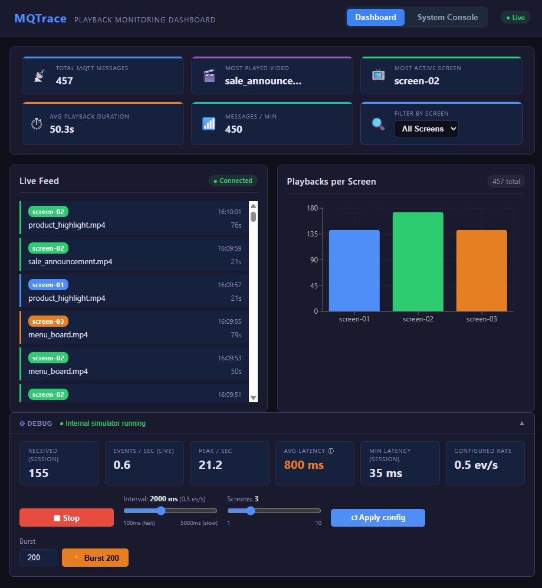
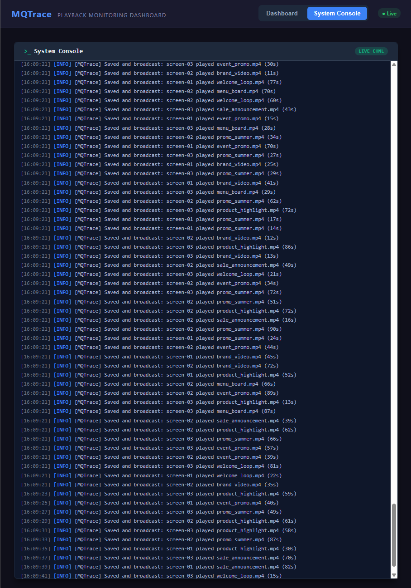

# MQTrace — Live Demo & Capabilities

> A visual walkthrough of MQTrace in action: real-time MQTT monitoring, analytics, and system observability.

---

## Overview

MQTrace is a full-stack observability platform for MQTT-driven digital signage networks. It receives playback events from distributed screen devices via an MQTT broker, persists them in PostgreSQL, and streams them in real time to a web dashboard over WebSockets (ActionCable).

---

## 1. System Running — Backend + Simulator

When the stack is started, two processes immediately come to life: the **Rails API backend** (left terminal) and the **Screen Simulator** (right terminal).


**Left terminal — Rails API:**
- Shows real-time SQL `INSERT` statements as each MQTT playback event is persisted into PostgreSQL
- Shows ActionCable `broadcast` calls delivering each event to all connected WebSocket clients
- Each line like `[MQTrace] Saved and broadcast: screen-03 played brand_video.mp4 (56s)` confirms end-to-end delivery

**Right terminal — Screen Simulator:**
- Simulates 3 real screens (`screen-01`, `screen-02`, `screen-03`) publishing MQTT events
- Each row shows: `[timestamp] | screen-id | asset-name | duration → topic`
- Configurable rate and asset library; supports burst mode for stress testing

---

## 2. Main Dashboard — Analytics & Live Feed

The primary view of the MQTrace web dashboard (`http://localhost:5173`), showing all analytics panels live.



### KPI Analytics Row
Six real-time metric cards at the top of the dashboard, all computed from **rolling accumulators** — they are never capped or reset:

| Card | Description |
|------|-------------|
| 📡 **Total MQTT Messages** | Running count of all events received since the session started |
| 🎬 **Most Played Video** | The asset with the highest total playback count |
| 📺 **Most Active Screen** | The screen ID with the most events |
| ⏱ **Avg Playback Duration** | Mean duration (in seconds) across all received events |
| 📶 **Messages / min** | Live throughput in the last 60 seconds — a real-time health signal |
| 🔍 **Filter by Screen** | Global dropdown that instantly filters **all** panels to a single screen |

### Live Feed Panel
A scrolling real-time list of playback events, newest at the top. Each card shows:
- **Screen badge** (color-coded: blue = screen-01, green = screen-02, orange = screen-03)
- Asset filename and playback duration
- Timestamp of the event

The Live Feed maintains its full history across tab switches — no data loss when navigating to System Console and back.

### Playbacks per Screen Chart
A bar chart showing the cumulative playback count per screen, driven by the same rolling accumulator as the KPI cards. The chart correctly reflects **all historical events**, not just the last visible window.

---

## 3. Early Dashboard Version

An earlier version of the dashboard showing the Live Feed, chart, and the (now removed) History table, illustrating how the UI has evolved.


This version already showed the core data pipeline working — real-time events flowing from MQTT into the live feed and chart. The history table was later removed in favor of the persistent Live Feed with scroll. 

---

## 4. System Console — Real-Time Observability

The **System Console** tab provides a mock-terminal view of the backend's internal log stream, delivered via a dedicated ActionCable WebSocket channel (`SystemLogsChannel`).



Every line is a structured log entry with:
- **Timestamp** (`[HH:MM:SS]`)
- **Severity level** (`[INFO]`, `[WARN]`, `[ERROR]`) — color coded
- **Log message** from the `MqttSubscriberService`

This allows developers and operators to verify in real time that:
- Messages are being received and processed
- The broker connection is healthy
- No silent failures are occurring in the background thread

> The System Console accumulates its history across tab switches thanks to the shared `SystemLogsContext` — switching to Dashboard and back preserves the full log history.

---

## Architecture at a Glance

```
Digital Screens / Simulator
        │ MQTT (QoS 1)
        ▼
  Mosquitto Broker  ←── mosquitto.conf (50k queue limit, persistent sessions)
        │
        ▼
Rails 8 MqttSubscriberService  (background thread)
        │
        ├──▶ PostgreSQL (PlaybackEvent INSERT)
        │
        └──▶ ActionCable broadcast
                  │
                  ├──▶ PlaybackChannel  →  React Dashboard (KPIs, Live Feed, Chart)
                  └──▶ SystemLogsChannel →  System Console tab
```

**Key technical decisions:**
- **React Context** (`PlaybackContext`, `SystemLogsContext`) — a single shared WebSocket per channel, preventing duplicate connections and state resets across tab navigation
- **RAF batch flushing** — incoming WebSocket messages are buffered and flushed to React state once per animation frame (~16ms), preventing UI freeze under burst loads
- **Rolling accumulators** in refs (never truncated) — all KPI metrics reflect true session totals, not a sliding window

---

## Running MQTrace

See the [README](README.md) for full setup instructions, dependency list, and Mosquitto configuration.
